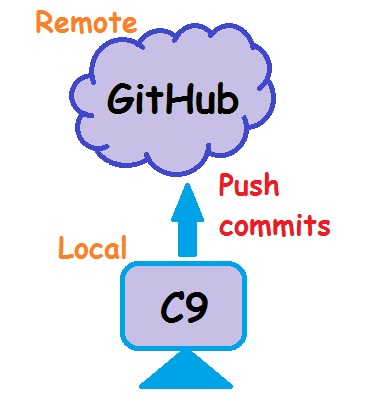

# GitHub Tutorial

_by Elizabeth Vazquez_

---
## Git vs. GitHub
**Git** is a version control system that tracks the changes you, as the user, will make in the command line. You can think of it as Git taking "snapshots" of your code. The _command line_ is a text interface that contains & transfers your commands in order to have them be run by your computer. The command line allows you to navigate through your computer's files and folders.

_Examples:_ Finder on Mac OS or Windows Explorer on Windows. Both filesystems store and organize your folders & files into a tree structure. 

A sketch of a filesystem could look like the one below:  
  
* In this case, _nyc_ is the _root directory_ because it is the folder that contains all the other folders and files.
* A _parent directory_ is a folder that contains other folders and/ or files within them. _brooklyn_ is a parent directory because it has _child directories_: _sunset-park_ and _bay-ridge_.
* Notice how the folder and file names are lowercase. This is just a convention among coders. 
* If your filename is longer than one word, you can connect them with a dash `-`. Please avoid placing a space in between, otherwise, the command line will assume you are referring to two folders/ files.
  * _the-bronx_ is recognized as **one** folder, but if you place a space between _the_ and _bronx_, the command line will recognize it as **two** folders.

The command line can be accessed by using the terminal which is indicated by a _shell prompt_ that appears as a `$`. Seeing this symbol indicates that a command is ready to be accepted. A table of the **General Commands** is provided under the **Workflow & Commands** section.

When you first start a Git project, it will be located in your computer, or local machine. The local browser-based IDE that you can use is [cloud 9](https://aws.amazon.com/cloud9/?origin=c9io). You will know when Git is running when you see `(master)` directly before `$`, therefore making the directory a _local repository_. A simple directory will not have Git running. Git is capable of being utilized without GitHub, therefore, you can work on a project in the command line before you have your code sent to the cloud (in this case, [github.com](https://github.com/)).

**GitHub**, not to be confused with Git, works hand-in-hand with Git. GitHub will store the code (that you created from Git) in the cloud. The _cloud_ can be defined as the location of multiple servers, accessible hard drives, or simply the _Internet_. That being said, GitHub requires Git to upload your work. GitHub visually follows your changes, therefore, allowing you to see the differences between previous commits (saved changes) and your current commits.

Because GitHub is an "open source", anyone can have access to your projects on the Internet. That is why GitHub is deemed as essential for collaboration on projects with files. Having your project on GitHub can also serve as a back-up copy in case you lose your project (via deletion, loss of password, a shut down of your local integrated development environment, etc.). One must be aware that if you choose to delete something in the command line, it will be permanently deleted and you will not be able to recover it unless you have a copy of it.

---
## Initial Setup

### Make Your Accounts
**Do you have a [GitHub account](https://github.com/join)? a [cloud 9 account](https://portal.aws.amazon.com/billing/signup?nc2=h_ct&src=header_signup&redirect_url=https%3A%2F%2Faws.amazon.com%2Fregistration-confirmation#/start)?**  
It's important to have a cloud 9 _and_ GitHub account in order to send your code to the cloud for colleagues and other viewers to see. The local repo on cloud 9 can be pushed to your remote repo in GitHub. Before jumping into your projects, follow the steps below to make your accounts:
1. If you are a student from the High School of Telecommunication Arts and Technology, your GitHub username should be your HSTAT email (excluding the "@hstat.org") and your password should include your HSTAT password, so you don't forget. Otherwise, follow the instructions as you please.
2. If a red bubble that says "something went wrong!" appears, ignore it.
3. Make sure you are signing up for a Free Account.
4. Check your email and verify with GitHub.
5. Now go to cloud 9 to create your cloud 9 account.
6. Go to the top right corner to click on the gear icon (Account Settings).
7. On the left, click "Connected Services".
8. Click the green "Connect" button to connect your cloud9 account with your GitHub account. From now on, you can click on the Octocat icon whenever you sign into cloud 9 because it will log you into cloud 9 _and_ GitHub.
9. Create a new workspace on cloud 9, name the workspace and give it a description.
10. Set the team as "Don't set a team for this workspace".
11. Choose the blank template and create the workspace.
12. It is recommended you turn on auto-save, so click on "Cloud 9" in the top menu > Preferences > Experimental > Files > Auto-Save > have it **ON** > restart the workspace.

### SSH Key
Creating a **S**ecure **SH**ell (SSH) Key is helpful when you decide to upload your Git projects to GitHub. Your Git project requires the URL, or location of your desired remote repo on GitHub. The locations could be from HTTPS or SSH, however, SSH is recommended. This is because SSH is more efficient in that it will only require a one-time setup (hence, an SSH Key), whereas HTTPS requires your login info everytime you want to upload your work. To create an SSH Key follow the steps below:  
1. Sign into your cloud 9 and GitHub accounts.
2. In cloud 9, click on the gear icon (Account Settings).
3. On the left sidebar, click on **SSH Keys** and copy the second long snippet of code under "Connect to your private git repository".
4. Go to GitHub.
5. Click on your Profile icon and then click on Settings.
6. On the left sidebar, click on "SSH and GPG keys"
7. Press on the green "New SSH key" to name your key (i.e. cloud 9) and paste the long snippet of code under "Key".
8. Press the green "Add SSH key". 
9. Go to cloud 9 in your workspace/ IDE.
10. Type in `ssh -T git@github.com` and you should receive a message that verifies a job well done. Congrats, you've set up an SSH Key!

---
## Repository Setup
**Initalize** - When you start a Git Project, you must first initialize your working directory with the command `git init`. You should only use this command **once** for every project. Now you're directory has been converted into a local repository.  
**Save** - You can start creating more folders and files within your project and editing the content within them. To create folders use `mkdir folder-name` and to create files use `touch filename`. You can save these changes instantly by pressing "Command S" on a Mac or "Ctrl S" on a Windows computer.  
**Add** - Once these changes are saved, you may feel like you are ready to have them added to the staging area. This means that you are one step closer to having your project's files committed. To add a file you should use the command `git add filename`. You can also add multiple files by separating the file names after `git add`.  
**Commit** - If you are satisfied with the files in the staging area, you can commit them. For this, you will use the command `git commit -m "message"`. You do not need to indicate the file names because the command line will commit, or take a "snapshot", of the files from the staging area.  
**New Repo** - Let's say you now decide to have your project uploaded to the Internet. Firstly, make sure you have an IDE (i.e. cloud 9) account, a github account and an SSH Key (refer to the **Initial Setup** section). If you don't already have a remote repo please follow these steps:
1. Go to github.com.
2. Click the plus icon in the top right corner and then click "New Repository".
3. Name your repository with the exact same name as the parent directory of the Git project you want uploaded.
4. Create the repository (verify your email if you're asked to).
5. When you are redirected to a different page, make sure you have "SSH" selected, not "HTTPS". This is within the **Quick setup** section of the page.
6. If you look further down in that page, you will see the section "... or push an existing repository from the command line". Copy and paste the two lines of code one at a time into cloud 9. The two lines of code should follow this syntax `git remote add origin <URL>` and `git push -u origin master`. You just made a remote repository.
7. Refresh your page on github.com and you should see the changes in your remote repository.

You can edit, add, commit, and push (with `git push`) as long as you wish to modify your local repo and have your changes sent to your remote repo.  

And that is the process from working on your Git project in cloud 9 to having it sent, or pushed, to GitHub.

---
## Workflow & Commands

* **Working Directory**  
When you begin using Git you are prepared with a parent directory. In this context, _directory_ is synonymous with _folder_. The intitial parent directory in [cloud 9](https://aws.amazon.com/cloud9/?origin=c9io), for example, is displayed as `~/workspace`. To create a Git project you have to initialize it with `git init` first. Now the directory is a local repository and you can begin typing many commands in the terminal after `$`. These commands are in the table **General Commands**. By modifying these files/ folders you are simply editing in your working directory. These changes can be viewed as you edit in cloud 9. You can do this by clicking the "Preview" tab at the top bar and clicking "Live Preview File (filename)".
* **Staging Area**  
You may decide to add your work to the staging area. Follow the process of working your way through the Git workflow from the **Repository Setup** section. While working between the working directory and staging area, it is recommended that you use `git status` to ensure that your files were successfully sent to the staging area. If they are, they will appear in green. If they weren't, they will appear in red in which case you may have to use `git add` again. You should also check that you are typing the correct filenames and are directly inside of the files' parent directory.
* **Repository**  
Committing your files from the staging area to the (local) repository basically accomplishes a complete change that contains all the edits you've made prior to the commit. If you would like to see your finished results, it's recommended that you push your commits to GitHub, because cloud 9 has some bugs. Once you push your commits you can visually view them in your remote repository by clicking the files or clicking on the "# commits" button above your files. The number of times you push a commit will be represented as a commit in GitHub.

### Helpful Analogy
_Imagine you are a photographer..._
| |Working Directory|Staging Area|Repository|
|-|-|-|-|
|Analogy|You are hired as a family photographer only **once**|You are **adding** people into the photo to prepare them for the picture|You have now taken the **picture** of the family|
|Coding|As the user, you initialize git in the working directory **once** at the **beginning**|You are **adding** edited or new files into the staging area to be prepared for committing|You have taken a **snapshot** of your files, now they are committed.|

### General Commands

|#|Command| Explanation |
|-|-|-|
|1|`..`|Typing `..` after the command `cd` allows you to navigate back a directory (to the parent directory of your current directory).|
|2|`~`|This symbol is called a tilde and it represents the parent of all the parent directories in the command line. In other words, it is the _root directory_ and you can navigate to it by using `cd ~`. You could navigate even further back, but it is **HIGHLY** recommended that your don't because you might damage your account and/ or computer.|
|3|`/`|The forward slash is a path separator in a file path. They are used to separate multiple file/ folder names in order to execute a single command.|
|4|↑ (up arrow)|Pressing the **up arrow** key of your keyboard will enable you to copy a previously used command without having to type the entire command. You can press on the **up arrow** as many times as you want to obtain the desired command.|
|5|(control C)|Pressing for **control C** will stop or interrupt a running task, therefore, handing control back to you, the user, and returning you to the prompt.|
|6|(control D)|Pressing for **control D** will not affect your progress in the command line, but it will exit the subprogram (indicated by `>`) that appears when a command is not recognized.|
|7|(tab)|Pressing on the **tab** key will autocomplete the name of the _argument_, or filename, you want to type after a command. This will work after you type in the first few characters of the argument and helps avoid spelling errors.|
|8|clear|Typing `clear` in the terminal will of course clear the command line of what was previously typed in without actually deleting your progress and modifications.|
|9|`pwd`|`pwd` is short for _print working directory_. The command will print the name of the current _directory_, or folder, you are inside of.|
|10|`ls`|The command `ls` determines the directory you are inside of and then _lists_, or prints, the names of the child folders or files that reside within the directory.|
|11|`cd`|`cd` is short for _change directory_. The argument, or the file/ folder name must be indicated in order to navigate to its location. Naming multiple directories (i.e. `cd nyc/brooklyn/bay-ridge/`) is very efficient when navigating. Moving back a directory requires the use of `cd ..`. Keep in mind that you cannot switch to a directory if it is neither the root directory (`cd ~`) or the immediate child/ parent directory of the current directory you are located in.|
|12|`mkdir`|`mkdir` is short for _make directory_. The folder you want created must be named after the command.|
|13|`rmdir`|`rmdir` is short for _remove directory_. You must indicate the name of the existing folder you want deleted and you must be in its corresponding parent directory to do so.|
|14|`touch`|`touch` is a command that creates files inside of the folder you are currently inside of. Arguments should be lowercase and have dashes if they contain more than one word. This command can hold many arguments like `mkdir`, though spaces between the arguments are necessary.|
|15|`rm`|`rm` is short for the removal and deletion of files from the file system. Any command that begins with `rm` will permanently delete what you indicate.|
|16|`rm -rf`|In this case, `rm -rf` will navigate to the root directory and delete it along with **all** its child directories and the child directories of those directories and so on. Even the files that your had protected will be forcibly deleted.|
|17|`mv (to rename)`|One of the functions of `mv` is to rename a file. First, you want to type `mv`, then the name of the file you want renamed, and finally the new name you want your file to be named.|
|18|`mv (to move)`|The second function for `mv` is to move files and directories into different locations within the file system by indicating the desired location afterwards. You may need to add a forward slash multiple times if both arguments are folders, but this is not needed if one is a file and the other is a folder. Multiple files can be moved with the location at the end of the command.|
|19|`c9 filename`|Typing this command will open up the indicated file for you to edit, but you must be in its parent folder for this to work.|

Please refer back to the sketch of a filesystem from the **Git vs. GitHub** section. If you use cloud 9 to create the filesystem using some of the commands from the table above, your code should result to this:  

### Git & GitHub Commands

|#|Command|Explanation|
|-|-|-|
|1|`git init`|Will initialize Git in a directory to convert it into a local repository for version control. This command should only be done in the beginning. It provides you with all the necessary tools to begin editing your project. Git is running if you see `(master)` before `$` in the terminal.|
|2|`rm -rf .git`|Will uninitialize Git if you used `git init` in the wrong directory. Git will not be running if you don't see `(master)` before `$` in the terminal.|
|3|`git add file`|Adds a directory/ directories to the staging area to be prepared for committing.|
|4|`git add .`|Efficient in that it adds the current/ entire directory - or at least the files that have been modified - to the staging area. Be aware that **only** new/ edited files will be added.|
|5|`git add --all`|Adds **ALL** changes, even deleted or renamed files.|
|6|`git commit -m "(short & specific) message"`|Will take a "snapshot" of the files on the stage. The message must be in the present-tense, short, specific, and most importantly meaningful. This message will help remind you of what you edited in your commit. Remember that the message cannot be changed, so be careful with what you write.|
|7|`git remote add origin URL`|A connection will be created between your local and remote repository while having your remote repo added. The location of your remote repo must be indicated by the URL, preferably in SSH form.|
|8|`git push -u origin master`|Your commits will be sent from your local repo in cloud 9 to your remote repo in GitHub. `-u` is short for _uptream_ and basically has git remember which remote repo/ branch to send your changes to. That way you can simply type in `git push` in the future from now on.|
|9|`git push`|Once you used `git push -u origin master` when you first pushed, or sent, your commits to the remote repo, this command can be used for future commits to be pushed. This makes pushing a lot more efficient.|
|10|`git diff`|Allows you to view the difference(s) between your current code and the previous commit.|
|11|`git log`|Helps you see your past commits. It's important to press the Q key to quit `git log` and return back to the terminal.|
|12|q (while in git log)|Pressing the Q key after typing `git log` is important because the command line might not allow you to continue typing in commands.|
|13|`git checkout -- file`|This will undo the changes/ edits that you've made to a file(s). Typing `git status` will suggest this command in case you forget its syntax. It's useful to use when collaborating or acccidentally editing a file(s) because it ensures that the file(s) will be reset to the last commit.|
|14|`git reset HEAD file`|Will unstage/ undo an added file. The file is added in green and not added in red when you type `git status`. It's useful when you accidentally add a file along with another one using `git add .`|
|15|`git remote -v`|Tells you where `git push` will send your commits to. `-v` stands for _verbose_ and wants you to give it all the information you can offer.|
|16|`git status`|An optional, but recommended command to help you see which files you edited from you last commit (in red). Will also show which files are staged for the commit (in green).|
|17|`git pull`|Will bring changes from a remote repo into your local repo. It does the opposite of `git push`.|
|18|`git reset --hard HEAD~1`|Will "nuke" or destroy your last commit, making the HEAD your previous commit with your files reset to their previous state as well. Will destroy the commit, the add, and the edits to lead us to our last commit. This is a very dangerous command.|
|19|`git reset HEAD~1`|Will undo a commit and the add while keeping your changes in case your commit wasn't satisfactory. Allows you to edit your files before making a better commit later on. The HEAD will be your previous commit, but your files are untouched. `git status` shows your file(s) in red. Helpful when a typo is detected or when you want to add something else after a commit.|
|20|`git reset --soft HEAD~1`|Will undo your commit, but leave your files & staging area untouched. `git status` shows the files have been left in the staging area in green. This is the very opposite of `git commit`. Allows you to change your commit message as you can't make edits in the staging area. In other words, it will undo your commit message.|

---
## Rolling Back Changes
There will be instances when coders will make mistakes and wish to undo them. However, sometimes you won't remember how the project was like previously. Fortunately, Git has commands that will help us with these types of situations.

**Undo an edit**  
You've accidentally edited a file? To undo these changes you can type in `git checkout -- file`. In case you ever forget this command, you can use `git status` and the command will suggest how to undo your edits. This will work assuming you were only in the working directory and haven't actually added your file(s) into the staging area. To reiterate, using this command will reset your files to how they appeared in the last commit you made.  
**Undo an add**  
You've accidentally added a file? This may happen when you accidentally add a file with another one by using `git add .` or when you suddenly realize that your file wasn't ready to be added and still needs to be worked on. In that case, you would need to use `git reset HEAD file` which will unstage a file in the staging area. Once again, you can use `git status` to verify whether or not the unstage was a success. You will know this when the file is in red instead of green.  
**Undo a commit**  
You accidentally made a commit? To undo a commit doesn't necessarily mean that you want to edit any files. In fact, you may want to change your commit message into something more suitable for the commit. Use `git reset --soft HEAD~1` to undo the commit. Typing `git status` will prove that your files are in the staging area because they are in green.  
**Undo an add and commit**  
If you want to undo an add and commit, you are intending to be back in the working directory to continue editing files. You can utilize `git reset HEAD~1` to do that. Your HEAD will become your previous commit, but your files remain the same. It's helpful when you spot typos or had intended on adding a different file.  
**Undo edits, an add, and a commit**  
Keep in mind that by undoing all three is, in a way, dangerous. You are essentially "nuking", or destroying your last commit which makes the HEAD the previous commit with the files reset as well.  
**Undo a push**  
First, you must type in `git log` in order to obtain the most recent commit `sha`. You will only need the first 7 characters of the `sha`. Those characters should be typed in after the command `git revert`. You can undo multiple pushes with their corresponding `sha`.  
Deleting the commits is like re-writing historic events and can be executed even from the remote repository. This will require the commands `git reset --hard sha` followed by `git push origin +master`. However, you probably shouldn't do this, especially if you're collaborating with others on GitHub.  

---
### Congratulations!
You have learned the basics of both Git and GitHub. The information provided above is extremely valuable if you're planning on growing as a software engineer. Thank you very much for reading my tutorial!